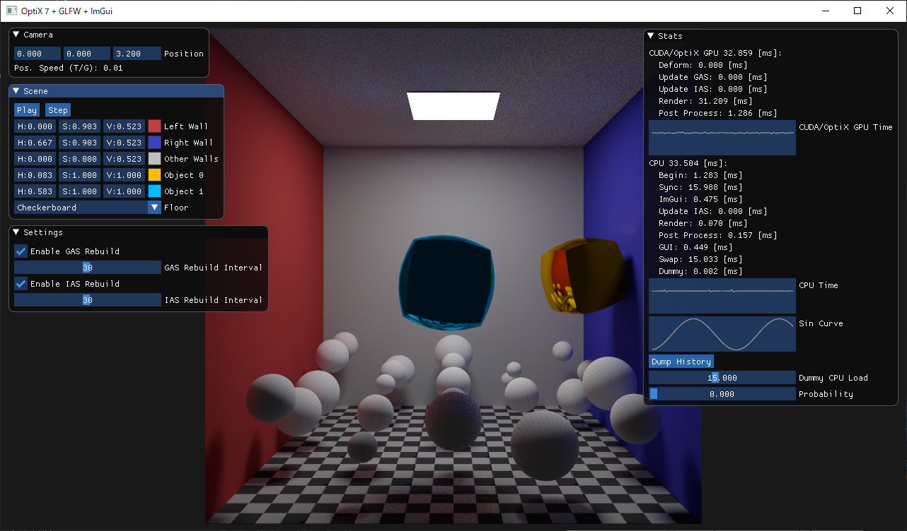

# OptiX Utility



[OptiX](https://developer.nvidia.com/optix)はOptiX 7以降[Direct X Raytracing (DXR)](https://microsoft.github.io/DirectX-Specs/d3d/Raytracing.html)にそっくりなローレベル指向なAPIになりました。<!--
-->細かいところに制御が効く一方で、何をするにも煩雑なセットアップコードを書く必要が出てきました。<!--
-->このOptiX Utilityは細かい制御性はできる限り保持したまま定形処理になりがちな部分を隠蔽したクラス・関数を提供することを目的としています。

[OptiX](https://developer.nvidia.com/optix) changes its form since OptiX 7 into a low-level oriented API similar to [Direct X Raytracing (DXR)](https://microsoft.github.io/DirectX-Specs/d3d/Raytracing.html).
It provides fine-level controllability but requires the user to write troublesome setup code to do anything.
The purpose of this OptiX Utility is to provide classes and functions which encapsulate parts that tend to be boilerplate code while keeping fine controllability.

## 機能 / Features
Currently based on OptiX 7.3.0
- Traversable types
  - [x] Single GAS
  - [x] Single-level instancing
  - [x] Multi-level instancing
- Primitive types
  - [x] Triangles
  - [x] Curves (Linear, Quadratic, Cubic B-Splines)
  - [x] User-defined custom primitives
- Motion blur types
  - [x] Instance motion blur
  - [x] Deformation blur
- Acceleration structure management
  - [x] Full build
  - [x] Fast update
  - [x] Compaction
  - [ ] Relocation
- Shader binding table management
  - Automatic build
  - Memory management is still under user control
- Geometry instancing with different material sets
- Callable programs
- OptiX AI denoiser
  - [x] LDR/HDR
  - [ ] Temporal
  - [ ] AOV
  - [ ] User
- Automatic payload/attribute value packing in kernel code
- [ ] Multi-GPU

## 構成要素 / Components
- **optix_util.h, optix_util_private.h, optix_util.cpp**\
  OptiXのオブジェクトをホスト側で管理するためのAPIと、デバイス側の関数ラッパーを提供しています。\
  This provides API to manage OptiX objects on host-side and device-side function wrappers.
- **cuda_util.h, cuda_util.cpp**\
  このCUDAユーティリティはCUDAのbufferやarrayの生成、そしてカーネルの実行のためのクラス・関数を提供しています。\
  現在のOptiXはCUDAに基づいたAPIになっているため、ユーザーはOptiXのコードと併せて頻繁に純粋なCUDAのコードも扱う必要があります。\
  これにはOptiX関連のコードは含まれず、OptiX Utilityとも直接関係しません。\
  This CUDA Utility provides classes and functions for CUDA buffer, array creation, and kernel execution.
  OptiX is now CUDA-centric API, so the user often needs to manage pure CUDA code along with OptiX code.\
  This doesn't contain any OptiX-related code and is not directly related to the OptiX Utility.
- **optixu_on_cudau.h**\
  OptiX UtilityをCUDA Utilityと組み合わせて使うための関数といくつかの補助クラスを定義した取るに足らないファイルです。\
  This trivial file defines a function to use OptiX Utility combined with the CUDA Utility and defines several auxiliary classes.
- **samples**\
  OptiX Utilityの基本的な使い方を網羅した複数のサンプルがあります。\
  Multiple samples cover basic usage of the OptiX Utility.

## コード例 / Code example
### ホスト側 / Host-side
OptiX UtilityはシェーダーバインディングテーブルのセットアップといったOptiXカーネルを実行するまでに必要な面倒な手続きを可能な限り隠蔽します。

OptiX utility hides troublesome procedures like setting up shader binding table required to execute OptiX kernels as much as possible.
```cpp
// Create an OptiX context from a CUDA context (Driver API).
optixu::Context optixContext = optixu::Context::create(cuContext);

// Create a pipeline and associated programs (groups) then link the pipeline.
optixu::Pipeline pipeline = optixContext.createPipeline();
pipeline.setPipelineOptions(optixu::calcSumDwords<PayloadSignature>(),
                            optixu::calcSumDwords<AttributeSignature>(),
                            "plp", sizeof(PipelineLaunchParameters),
                            false, OPTIX_TRAVERSABLE_GRAPH_FLAG_ALLOW_ANY,
                            OPTIX_EXCEPTION_FLAG_STACK_OVERFLOW | OPTIX_EXCEPTION_FLAG_TRACE_DEPTH |
                            OPTIX_EXCEPTION_FLAG_DEBUG,
                            OPTIX_PRIMITIVE_TYPE_FLAGS_TRIANGLE);
optixu::Module mainModule = pipeline.createModuleFromPTXString(ptx, OPTIX_COMPILE_DEFAULT_MAX_REGISTER_COUNT,
                                                               OPTIX_COMPILE_OPTIMIZATION_DEFAULT, OPTIX_COMPILE_DEBUG_LEVEL_LINEINFO);
optixu::ProgramGroup rayGenProgram = pipeline.createRayGenProgram(module, RT_RG_NAME_STR("pathtracing"));
// ...
optixu::ProgramGroup searchRayHitProgramGroup =
    pipeline.createHitProgramGroupForBuiltinIS(
        OPTIX_PRIMITIVE_TYPE_TRIANGLE,
        mainModule, RT_CH_NAME_STR("shading"), emptyModule, nullptr);
optixu::ProgramGroup visibilityRayHitProgramGroup =
    pipeline.createHitProgramGroupForBuiltinIS(
        OPTIX_PRIMITIVE_TYPE_TRIANGLE,
        emptyModule, nullptr, mainModule, RT_AH_NAME_STR("visibility"));
// ...
pipeline.link(2, OPTIX_COMPILE_DEBUG_LEVEL_FULL);

// Allocate a shader binding table (scene independent part).
cudau::Buffer sbt;
size_t sbtSize;
scene.generateShaderBindingTableLayout(&sbtSize);
//...
pipeline.setShaderBindingTable(sbt, sbt.getMappedPointer());

// Create materials.
optix::Material defaultMat = optixContext.createMaterial();
defaultMat.setHitGroup(RayType::Search, searchRayHitProgramGroup);
defaultMat.setHitGroup(RayType::Visibility, visibilityRayHitProgramGroup);
// ...
defaultMat.setUserData(...);

// Create a scene.
optixu::Scene scene = optixContext.createScene();

// Create geometry instances (triangles or curves or user-defined custom primitives).
optixu::GeometryInstance geomInst0 = scene.createGeometryInstance();
cudau::TypedBuffer<Vertex> vertexBuffer;
cudau::TypedBuffer<Triangle> triangleBuffer;
// ...
geomInst0.setVertexBuffer(vertexBuffer);
geomInst0.setTriangleBuffer(triangleBuffer);
geomInst0.setUserData(...);
geomInst0.setNumMaterials(1, BufferView());
geomInst0.setGeometryFlags(0, OPTIX_GEOMETRY_FLAG_NONE);
geomInst0.setMaterial(0, 0, defaultMat);

OptixAccelBufferSizes asMemReqs;

// Create geometry acceleration structures.
optixu::GeometryAccelerationStructure gas0 = scene.createGeometryAccelerationStructure();
gas0.setConfiguration(optixu::ASTradeoff::PreferFastTrace, true, true, false); // Builder preference.
gas0.addChild(geomInst0);
gas0.addChild(geomInst1);
gas0.addChild(...);
gas0.setUserData(...);
optixu::GeometryAccelerationStructure gas1 = scene.createGeometryAccelerationStructure();
// ...
cudau::Buffer gas0Mem;
gas0.prepareForBuild(&asMemReqs);

// Create instances.
optixu::Instance inst0 = scene.createInstance();
inst0.setChild(gas0);
inst0.setTransform(...);
optixu::Instance inst1 = scene.createInstance();
// ...

// Create instance acceleration structures.
optixu::InstanceAccelerationStructure ias0 = scene.createInstanceAccelerationStructure();
ias0.setConfiguration(optixu::ASTradeoff::PreferFastBuild, true, true); // Builder preference.
ias0.addChild(inst0);
ias0.addChild(inst1);
ias0.addChild(...);
optixu::InstanceAccelerationStructure ias1 = scene.createInstanceAccelerationStructure();
// ...
cudau::TypedBuffer<OptixInstance> instBuffer;
cudau::Buffer ias0Mem;
ias0.prepareForBuild(&asMemReqs);

// Build acceleration structures.
cudau::Buffer asBuildScratchMem;
// ...
OptixTraversableHandle gas0Handle = gas0.rebuild(cuStream, gas0Mem, asBuildScratchMem);
// ...
OptixTraversableHandle ias0Handle = ias0.rebuild(cuStream, instBuffer, ias0Mem, asBuildScratchMem);

// Allocate a shader binding table (scene dependent part).
cudau::Buffer hitGroupSbt;
size_t hitGroupSbtSize;
scene.generateShaderBindingTableLayout(&hitGroupSbtSize);
// ...

// Associate the pipeline and the scene/shader binding table.
pipeline.setScene(scene);
pipeline.setHitGroupShaderBindingTable(hitGroupSbt, hitGroupSbt.getMappedPointer());

// Setup pipeline launch parameters and allocate memory for it on the device.
PipelineLaunchParameter plp;
// ...
CUdeviceptr plpOnDevice;
cuMemAlloc(&plpOnDevice, sizeof(plp));

// Launch the pipeline!
cuMemcpyHtoDAsync(plpOnDevice, &plp, sizeof(plp), cuStream);
pipeline.launch(cuStream, plpOnDevice, width, height, 1);
//...
```

### デバイス側 / Device-side
OptiX Utilityはペイロードのパッキングを簡単にしたりカーネル間通信における型の不一致を回避するため、デバイス側の組み込み関数のラッパーを提供しています。

OptiX utility provides template wrapper for device-side built-in functions to ease packing of payloads and to avoid type inconsistency for inter-kernel communications.
```cpp
#define SearchRayPayloadSignature PCG32RNG, SearchRayPayload*
#define VisibilityRayPayloadSignature float
// ...
CUDA_DEVICE_KERNEL void RT_RG_NAME(pathtracing)() {
    // ...
    SearchRayPayload* payloadPtr = &payload;
    while (true) {
        // ...
        optixu::trace<SearchRayPayloadSignature>(
            traversable, origin, direction,
            0.0f, FLT_MAX, 0.0f, 0xFF, OPTIX_RAY_FLAG_NONE,
            RayType_Search, NumRayTypes, RayType_Search,
            rng, payloadPtr);
        // ...
    }
    // ...
}
// ...
CUDA_DEVICE_KERNEL void RT_CH_NAME(shading)() {
    auto sbtr = reinterpret_cast<HitGroupSBTRecordData*>(optixGetSbtDataPointer());
    // ...
    PCG32RNG rng;
    SearchRayPayload* payload;
    optixu::getPayloads<SearchRayPayloadSignature>(&rng, &payload);
    // ...
    {
        // ...
        float visibility = 1.0f;
        optixu::trace<VisibilityRayPayloadSignature>(
            traversable, p, shadowRayDir, 0.0f, dist * 0.999f, 0.0f, 0xFF, OPTIX_RAY_FLAG_NONE,
            RayType_Visibility, NumRayTypes, RayType_Visibility,
            visibility);
        // ...
    }
    // ...
    optixu::setPayloads<SearchRayPayloadSignature>(&rng, nullptr);
}
// ...
CUDA_DEVICE_KERNEL void RT_AH_NAME(visibility)() {
    float visibility = 0.0f;
    optixu::setPayloads<VisibilityRayPayloadSignature>(&visibility);

    optixTerminateRay();
}
// ...
```

## 動作環境 / Confirmed Environment
現状以下の環境で動作を確認しています。\
I've confirmed that the program runs correctly in the following environment.

* Windows 10 (20H2) & Visual Studio Community 2019 (16.9.4)
* Core i9-9900K, 32GB, RTX 3080 10GB
* NVIDIA Driver 466.11

動作させるにあたっては以下のライブラリが必要です。\
It requires the following libraries.

* CUDA 11.2 \
  OptiX Utilityは少し古いバージョンでも動作するとは思います。単にサンプルコードがこのバージョンに依存しているだけです。\
  ※CUDA 11.3には現状バグがあり、OptiX Utilityと一緒に使用することができません。\
  OptiX Utility may work with a bit older versions. The sample code just assumes this version.\
  \* CUDA 11.3 currently has a bug which prevents to use it with OptiX Utility.
* OptiX 7.3.0 (requires Maxwell or later generation NVIDIA GPU)

## ライセンス / License
Released under the Apache License, Version 2.0 (See [LICENSE.md](LICENSE.md))

----
2021 [@Shocker_0x15](https://twitter.com/Shocker_0x15)
